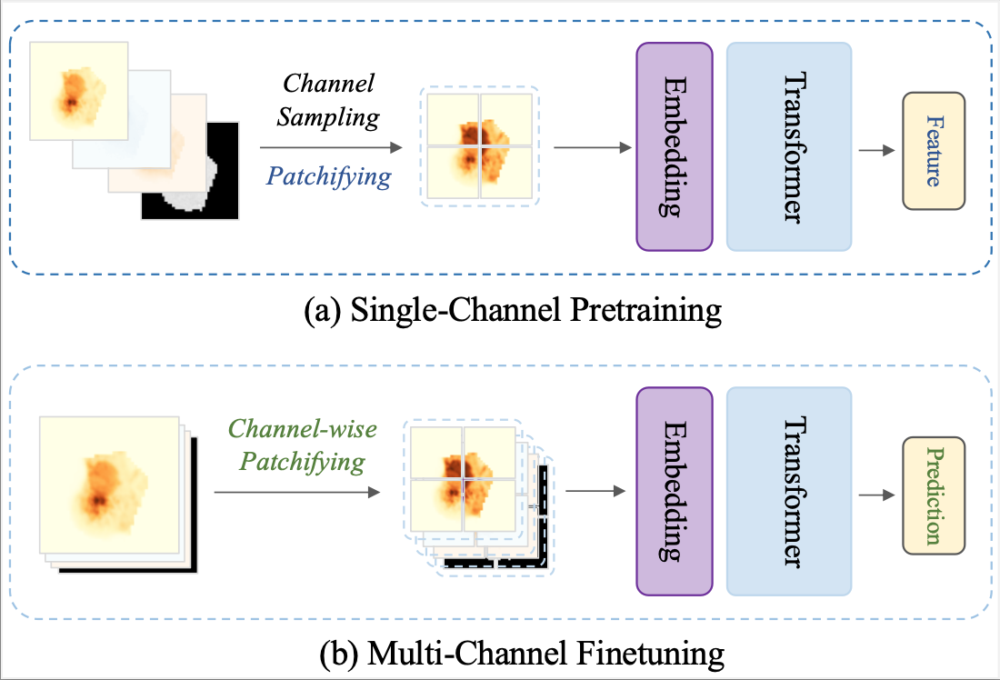

# IC-ViT
Code for the paper: "Isolated Channel Vision Transformers: From Single-Channel Pretraining to Multi-Channel Finetuning"

<p align="center">
     <br>
</p>

## Setup
1. Download the code and navigate to the project directory:
```Shell
git clone https://github.com/shermanlian/IC-ViT.git
cd IC-ViT
```

2. Set up the environment with all required dependencies:

```Shell
conda env create -f environment.yml
conda activate icvit
```
## Pretraining

Here we provide an example of pretraining on So2Sat using our framework.

```Shell
cd ICVIT-pretrain/
```
```Bash
# Example: pretraining with 2 GPUs
OMP_NUM_THREADS=8 torchrun --nnodes=1 --nproc_per_node=2 \
  train_dino.py \
  --batch-size 512 \
  --image-size 32 \
  --local_crops_number 0 \
  --run-name clean-code-test \
  --epochs 201 \
  --saveckp-freq 100
```

```Bash
# Convert the pretrained checkpoint to downstream format
python convert_dino_checkpoint.py
```
## Finetuning

This code automatically logs metrics for each dataset and epoch using **Weights & Biases (wandb)**.

```Shell
cd icvit
```

```Bash
python icvit/main/main_supervised.py \
    trainer.devices=2 \
    trainer.max_epochs=100 \
    meta_arch/backbone=icvit_small \
    meta_arch.backbone.args.in_chans=8 \
    meta_arch.backbone.args.patch_size=16 \
    meta_arch.backbone.checkpoint=../dino-imagenet/checkpoints/jumpcp_checkpoint0100.pth\
    meta_arch.target='label' \
    meta_arch.num_classes=161 \
    data@train_data=jumpcp \
    data@val_data_dict=[jumpcp_val_fl,jumpcp_test_fl] \
    train_data.jumpcp.loader.batch_size=32 \
    transformations@train_transformations=cell \
    transformations@val_transformations=cell
```


## Checkpoints
tbu

## Acknowledgements
- The implementation of the ChannelViT model and the dataloaders for So2Sat and JUMP-CP are adapted from the official [ChannelViT](https://github.com/insitro/ChannelViT) repository.

- The CHAMMI baseline models, dataloader, and evaluation benchmark are implemented based on [CHAMMI](https://github.com/chaudatascience/channel_adaptive_models), [MorphEm](https://github.com/broadinstitute/MorphEm) and [DiChaViT](https://github.com/chaudatascience/diverse_channel_vit/tree/main)
  
## Citation
We’d appreciate it if you cite the following when using this work:
```
@article{lian2025isolated,
  title={Isolated channel vision transformers: From single-channel pretraining to multi-channel finetuning},
  author={Lian, Wenyi and Lindblad, Joakim and Micke, Patrick and Sladoje, Nata{\v{s}}a},
  journal={arXiv preprint arXiv:2503.09826},
  year={2025}
}
```
## Contact
Thank you for your interest! If you have any questions, please contact:
wenyi.lian@it.uu.se
